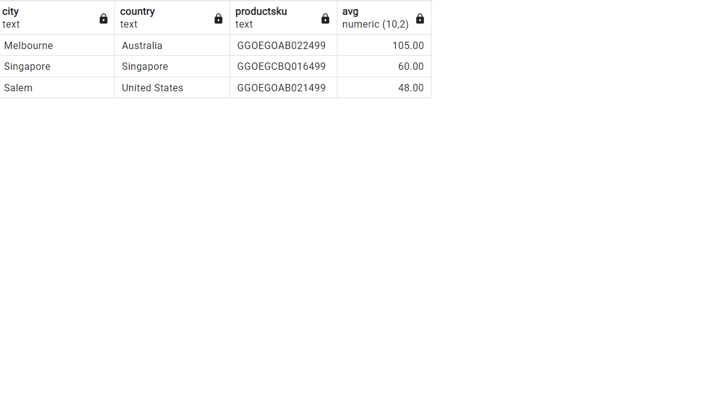
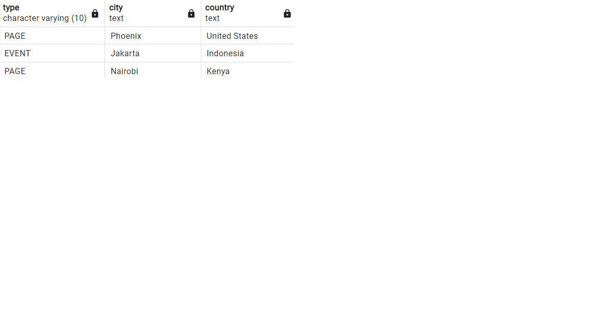
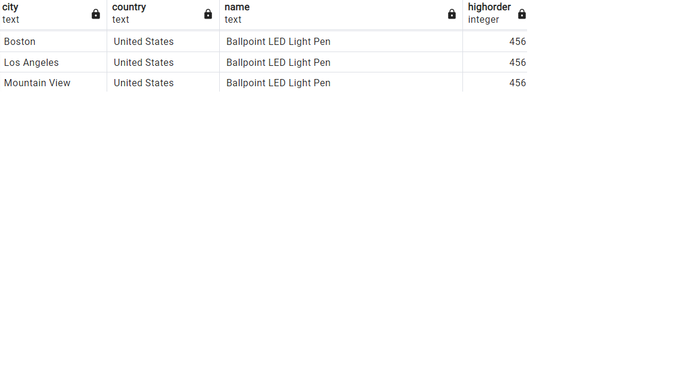
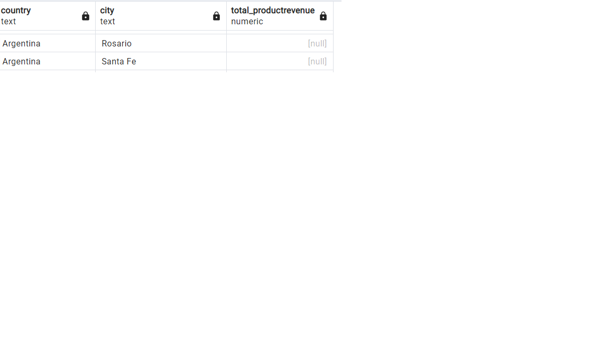

Answer the following questions and provide the SQL queries used to find the answer.

    
**Question 1: Which cities and countries have the highest level of transaction revenues on the site?**

SQL Queries:    SELECT DISTINCT city,
                        country,
                        transactionrevenue
                          FROM   all_sessions
                              WHERE 
                	             transactionrevenue =(
		                            SELECT
	        		        MAX( transactionrevenue )
	                	FROM
	            		all_sessions
                    	)

Answer: USA has the highest level of transaction revenues on the sites about 1015480000

**Question 2: What is the average number of products ordered from visitors in each city and country?**

SQL Queries:    SELECT DISTINCT 
                         sessions.city,
		                 sessions.country,
		                 sales.productsku,
                      AVG (total_ordered) :: NUMERIC(10,2)
                     FROM sales_by_sku AS sales
		                    INNER JOIN all_sessions AS sessions
		                    ON sales.productsku = sessions.productsku
	                    	GROUP BY sales.productsku,sessions.city,
		                             sessions.country,sessions.visitid, sessions.productsku

Answer: 
         total rows:4947

**Question 3: Is there any pattern in the types (product categories) of products ordered from visitors in each city and country?**

SQL Queries:        SELECT DISTINCT type,
                                    city,
				                    country
                                    FROM all_sessions AS sessions
                                    LEFT JOIN analytics AS ana
                                    ON ana.fullvisitorid = sessions.fullvisitorid
                                    LEFT JOIN sales_report AS sales
                                    ON sessions.productsku = sales.productsku

Answer: 
        total rows:514

**Question 4: What is the top-selling product from each city/country? Can we find any pattern worthy of noting in the products sold?**

SQL Queries:    
                    SELECT  DISTINCT city,
				country,
				reports.name,
				MAX(total_ordered) as highorder
				FROM all_sessions AS sessions
                     JOIN sales_report AS reports
                ON sessions.productsku = reports.productsku 
                WHERE city !='not available in demo dataset'
                GROUP BY reports.name,city,country
                ORDER BY highorder DESC

Answer:  
         total rows:2826

**Question 5: Can we summarize the impact of revenue generated from each city/country?**

SQL Queries:  SELECT country,city,
                SUM(productrevenue) AS    total_productrevenue
                FROM all_sessions AS sessions
                JOIN products AS pro
				ON sessions.productsku=pro.sku
                JOIN sales_by_sku AS sales
				ON sales.productsku=pro.sku
                WHERE country != '(not set)' AND city != '(not set)'
                GROUP BY country,city
                ORDER BY country,city,total_productrevenue DESC

Answer: 
        total rows:358

